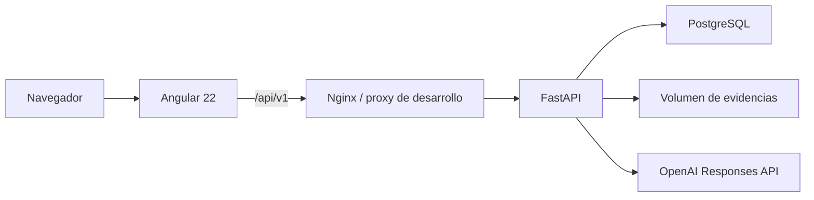
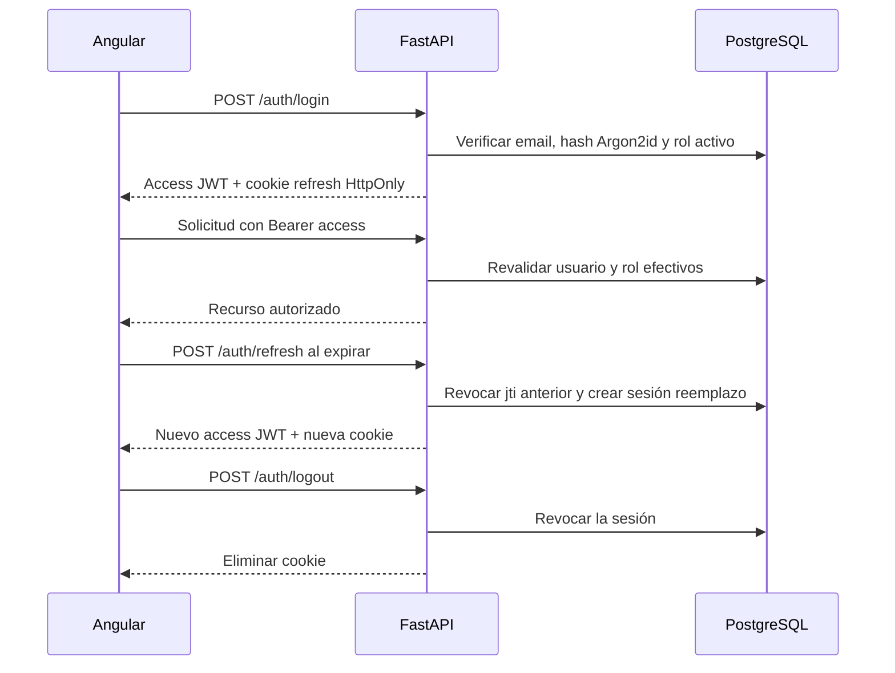
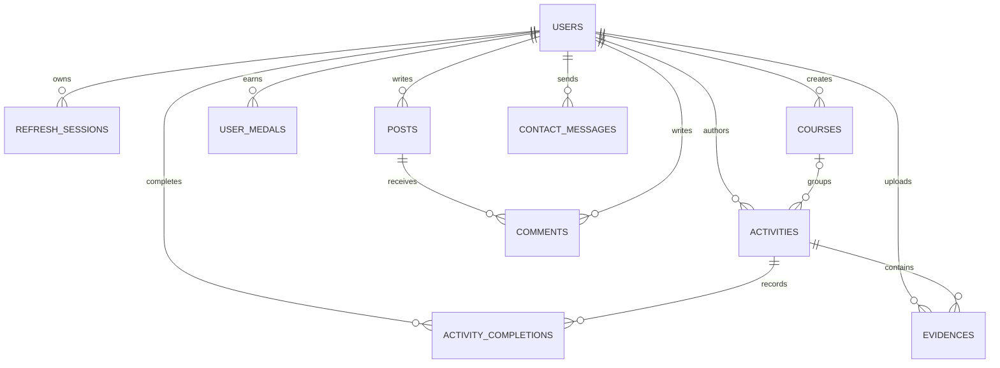
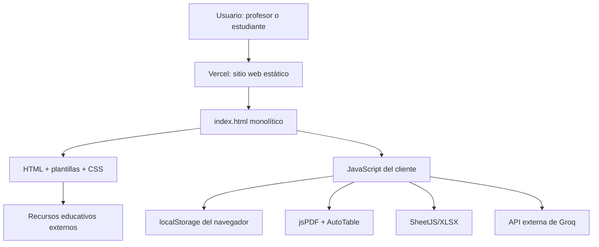

# Contexto técnico de `T4/Projecto`

## Migración Angular 22 + FastAPI implementada

El 24 de julio de 2026 se autorizó reemplazar el prototipo estático por una
aplicación persistente, modular y dockerizable. Esta sección registra el
objetivo, las decisiones y el resultado comprobado de la migración.

### Objetivo

- Frontend Angular 22 con componentes standalone y archivos visuales separados
  del código TypeScript.
- API FastAPI modular con autenticación JWT access/refresh.
- PostgreSQL controlado por SQLAlchemy 2 y Alembic.
- Evidencias en volumen persistente y metadatos en PostgreSQL.
- Integración OpenAI únicamente desde el backend.
- Ambientes `dev` y `prod`, ambos dockerizables.
- Conservación visual y funcional de los dos roles, con corrección de
  inconsistencias de publicación y eliminación de actividades.

### Decisiones confirmadas

- PostgreSQL externo por `DATABASE_URL`, host privado y puerto 53514.
- Bases separadas para desarrollo, pruebas y producción.
- El registro docente mantiene el selector visible, pero exige un código de
  invitación validado por FastAPI.
- Se mantienen los dos perfiles demo y sus credenciales históricas en las
  semillas de desarrollo y producción por decisión explícita del usuario.
- El chat continúa anónimo y su historial permanece solo en memoria.
- Los archivos de evidencia se guardan en un volumen local de la aplicación.
- No se migran los datos de `localStorage`.
- El HTML histórico se elimina una vez validado el reemplazo.
- La carpeta se inicializa como repositorio Git independiente en la rama
  `master`, sin remoto.

### Arquitectura objetivo



### Resultado de la implementación

La fuente activa quedó dividida en dos aplicaciones:

```text
Projecto/
├── frontend/                  Angular 22 y Nginx
├── backend/                   FastAPI, SQLAlchemy y Alembic
├── docker-compose.dev.yml     Desarrollo con recarga y .env
├── docker-compose.prod.yml    Producción sin env_file
├── .github/workflows/ci.yml   Integración continua y publicación privada
├── .env.example               Contrato de configuración sin secretos
├── README.md                  Guía académica y operativa
├── AGENTS.md                  Reglas de mantenimiento
└── CONTEXT.md                 Memoria técnica
```

El HTML monolítico fue eliminado después de superar las pruebas automatizadas
y el build de producción. No se importaron datos desde `localStorage`. El
archivo `URL pagina web.txt` se conservó sin cambios como trazabilidad del
despliegue histórico.

La carpeta se inicializó como repositorio Git independiente en la rama `master`,
sin remoto configurado. El repositorio académico padre no fue reconfigurado ni
se alteró su índice.

#### Frontend

- Angular 22 con componentes standalone, signals y rutas lazy.
- `core` concentra autenticación, guardia, interceptor, modelos, errores y
  estado compartido.
- `shared` contiene notificaciones reutilizables.
- `features` separa `auth`, `dashboard`, `activities`, `courses`,
  `simulations`, `library`, `blog`, `profile`, `contact`, `reports` y `chat`.
- HTML, TypeScript y SCSS están separados; no existen templates o estilos
  inline en los componentes.
- El access token vive únicamente en memoria. La restauración de sesión usa el
  refresh token en cookie HttpOnly.
- PDF y XLSX se cargan de forma diferida para no aumentar el bundle inicial.
- Los textos de interfaz están en español y el código en inglés.
- Se preservaron la identidad visual, Plus Jakarta Sans, tarjetas, gradientes,
  iconografía y cortes responsive de 900 px y 560 px.

El 25 de julio de 2026 se detectó que la primera composición Angular conservaba
la marca, pero había rediseñado el login y el tablero en lugar de reproducir el
prototipo. Se corrigió tomando como fuente vinculante el HTML histórico y las
capturas de referencia. El frontend vuelve a usar el contenedor de 1140 px,
fondo `#f0f4fb`, encabezado flotante, tarjetas blancas, navegación modular en
dos columnas, barra lateral con perfil/novedades/panel docente, pie fijo y
LeFoBot en formato de píldora. La corrección no modifica contratos HTTP,
autenticación, persistencia ni reglas de negocio.

#### Backend

| Módulo | Responsabilidad |
| --- | --- |
| `auth` | Registro, acceso, refresh rotativo, logout y sesiones revocables |
| `users` | Consulta y actualización del perfil propio |
| `courses` | Catálogo y creación exclusiva del profesor |
| `activities` | Borradores, publicación, finalización y eliminación consistente |
| `evidences` | Validación, volumen, metadatos y descarga autorizada |
| `gamification` | Puntos, nivel y catálogo/asignación de ocho medallas |
| `blog` | Publicaciones y comentarios |
| `contact` | Mensajes persistentes de contacto |
| `reports` | Reporte propio del estudiante y reporte general docente |
| `chat` | Adaptador OpenAI, límites y respuesta temporal |
| `health` | Comprobaciones de proceso y de conexión a PostgreSQL |

Los routers se limitan al contrato HTTP y sus dependencias. Las reglas
funcionales están en servicios. El almacenamiento de archivos y el cliente de
OpenAI son dependencias sustituibles; no se añadieron repositorios vacíos ni
capas de dominio ceremoniales.

### Flujo de autenticación



Los access JWT duran 15 minutos y los refresh JWT 7 días. Ambos incluyen
`sub`, `type`, `jti`, `iss`, `aud`, `iat` y `exp`. El rol no se confía al
token: siempre se consulta nuevamente en PostgreSQL.

### Modelo persistente



Restricciones relevantes:

- email normalizado y único sin distinción de mayúsculas;
- una finalización por estudiante y actividad;
- una evidencia por estudiante y actividad;
- una medalla de cada clave por usuario;
- estados de actividad `draft` y `published`;
- roles `teacher` y `student`;
- claves foráneas e índices creados por Alembic;
- UUID y fechas UTC en todas las entidades públicas.

La eliminación de una actividad recupera primero los archivos relacionados,
elimina finalizaciones y metadatos en una transacción, y recalcula puntos y
medallas. Los fallos de limpieza física se registran sin revelar rutas al
cliente.

### Contrato HTTP

La API usa el prefijo `/api/v1`, JSON público en `camelCase`, modelos internos
en `snake_case` y errores con código técnico en inglés y mensaje visible en
español.

| Área | Operaciones |
| --- | --- |
| Auth | `POST /auth/register`, `/auth/login`, `/auth/refresh`, `/auth/logout` |
| Perfil | `GET /users/me`, `PATCH /users/me` |
| Cursos | `GET /courses`, `POST /courses` |
| Actividades | `GET /activities`, `POST /activities`, publicación, eliminación y finalización |
| Evidencias | carga, listado docente y descarga autorizada |
| Gamificación | progreso propio y catálogo de medallas |
| Blog | listado/creación de publicaciones y comentarios |
| Contacto | creación de mensajes persistentes |
| Reportes | reporte propio y reporte general docente |
| Chat | mensaje anónimo con control de abuso |
| Salud | `/health/live` y `/health/ready` |

Registro, login, refresh, chat y salud son públicos. El resto exige usuario
activo. Las operaciones docentes y las evidencias aplican además rol o
propiedad en el backend.

### Ambientes y despliegue

| Elemento | `dev` | `prod` |
| --- | --- | --- |
| Configuración | `.env` explícito | Variables inyectadas por el sistema de despliegue |
| Frontend | servidor Angular con recarga | build estático servido por Nginx |
| Backend | Uvicorn con recarga | Uvicorn, usuario no privilegiado |
| OpenAPI | habilitado | deshabilitado |
| Refresh cookie | HttpOnly, SameSite Lax | además `Secure=true` |
| Base | `prj_grado_dev` | `prj_grado_prod` |

`prj_grado_test` es una base aislada para CI y no constituye un tercer
ambiente desplegable. Producción no referencia `env_file`. Nginx resuelve rutas
SPA, reenvía `/api`, añade cabeceras de seguridad y no expone el volumen.

### Pruebas y validación ejecutadas

| Verificación | Resultado local |
| --- | --- |
| Backend pytest | 17 pruebas aprobadas |
| Cobertura backend | 94,10 % global |
| Frontend Vitest | 36 pruebas aprobadas en 19 archivos; cada componente tiene `.spec.ts` |
| Cobertura frontend | 88,46 % statements; 85,87 % branches; 81,87 % funciones; 86,34 % líneas |
| Build Angular prod | aprobado sin advertencias; bundle inicial 358,00 kB sin comprimir |
| Aceptación visual | login y panel docente comprobados a 1920 px, 900 px y 560 px, sin desbordamiento horizontal |

Evidencia de escritorio:

- [Inicio de sesión reconstruido](docs/visual-validation/login-1920.png).
- [Panel docente reconstruido](docs/visual-validation/dashboard-teacher-1920.png).
| Contrato API | 22 rutas requeridas presentes; 23 rutas documentadas |
| Alembic offline | migración inicial genera SQL correctamente |
| Alembic con PostgreSQL | `upgrade head` aplicado al iniciar y `alembic check` sin operaciones pendientes |
| Docker Compose dev | backend saludable y frontend activo |
| Salud HTTP | API `ready`; frontend HTTP 200 |
| Umbrales | superados: 80 % general y 75 % branches |

Las dependencias no ESM transitivas de jsPDF/canvg se declararon
explícitamente como compatibles. Las exportaciones están lazy-loaded y el
build final termina sin advertencias.

El 25 de julio de 2026 se corrigió el inicio de Docker causado por
`CORS_ORIGINS`. `pydantic-settings` intentaba decodificar como JSON el valor
separado por comas antes de ejecutar el validador del proyecto. El campo quedó
marcado con `NoDecode`, se añadieron pruebas para uno o varios orígenes y para
el valor vacío, y se documentó el formato admitido. La corrección se verificó
con la configuración real de desarrollo, la suite completa, reconstrucción de
imágenes, migración, semilla, estado saludable y respuestas HTTP de ambos
servicios.

El 26 de julio de 2026 se normalizó el nombre DNS interno del backend como
`lefodigital-backend`. Nginx, el proxy Angular para Docker, los servicios de
Docker Compose y el Service de Kubernetes usan desde entonces el mismo nombre.
Los nombres del módulo, la carpeta `backend`, las etiquetas de componente y el
campo estructural `backend` del recurso Ingress no se modifican.

La primera ejecución en Kubernetes reveló dos fallos de contrato de imagen. El
backend completaba Alembic, pero Uvicorn rechazaba `LOG_LEVEL=INFO`; el
entrypoint ahora normaliza el nivel a minúsculas, valida los valores admitidos
y la imagen crea explícitamente el usuario `10001:10001`. El frontend publicado
todavía contenía el upstream histórico `backend:8000` y no podía arrancar. Su
imagen ahora usa una configuración Nginx completa para ejecución no
privilegiada como `101:101`, escucha en `8080`, escribe PID y temporales bajo
`/tmp`, conserva el upstream `lefodigital-backend:8000` y funciona con raíz de
solo lectura. CI construye ambas imágenes y prueba salud, proxy, UID/GID,
filesystem de solo lectura y temporales antes de publicar.

El 26 de julio de 2026 se actualizó la documentación principal para que el
README funcione como guía académica y operativa de la solución activa. También
se extendió GitHub Actions con una etapa de publicación de imágenes privadas en
GitLab Container Registry. La publicación se ejecuta solo en `master`, después
de superar backend, frontend y revisión de seguridad, y usa tags por commit y
`latest`.

### Validaciones externas pendientes

- Incorporar las capturas de aceptación visual a 900 px y 560 px a la
  evidencia formal TRL5; las capturas de escritorio ya están conservadas.
- Probar LeFoBot con una clave OpenAI suministrada en el despliegue.
- Rotar o revocar cualquier credencial histórica que haya estado expuesta fuera
  de los mecanismos seguros de configuración.
- Configurar los remotos oficiales de GitHub y GitLab, crear las credenciales
  del registro privado y actualizar la URL cuando se defina el despliegue
  definitivo.

### Criterios validados antes de retirar el legado

- Autenticación, renovación, cierre y separación de permisos.
- Registro de estudiante y profesor con invitación.
- Actividades draft/published, finalización idempotente y eliminación
  consistente.
- Evidencias validadas, persistentes y autorizadas.
- Puntos, niveles y ocho medallas sin duplicación.
- Cursos, blog, perfil, contacto y reportes de ambos roles.
- Chat sin secretos en el cliente y con fallos comprensibles.
- Pruebas unitarias Angular con Vitest.
- Pruebas unitarias/API FastAPI con pytest.
- Migración Alembic sobre una base PostgreSQL de pruebas.
- Build de producción y revisión responsive a 900 px y 560 px.
- Revisión final de secretos antes de inicializar Git.

## Navegación

- [Reglas técnicas de esta carpeta](AGENTS.md).
- [Guía de operación](README.md).
- [Plan final implementado](../IMPLEMENTATION_PLAN.md).
- [Entrada del frontend](frontend/src/main.ts).
- [Rutas Angular](frontend/src/app/app.routes.ts).
- [Entrada del backend](backend/app/main.py).
- [Migraciones Alembic](backend/alembic/env.py).
- [Archivo con la URL del despliegue](<../URL%20pagina%20web.txt>).
- [Reglas de la Fase 4](../AGENTS.md).
- [Contexto académico de la Fase 4](../CONTEXT.md).
- [Reglas generales](../../AGENTS.md).
- [Contexto general](../../CONTEXT.md).

## Análisis del prototipo legado (registro histórico)

Las secciones siguientes documentan el monolito retirado y explican por qué se
realizó la migración. Las rutas, tecnologías y riesgos descritos aquí no
representan la fuente activa.

### Resumen ejecutivo del legado

LeFodigital es un prototipo web educativo estático, desplegado públicamente y construido en un único archivo HTML con CSS y JavaScript embebidos. Presenta dos experiencias de usuario —profesor y estudiante— e incluye autenticación simulada, actividades, cursos, recursos externos, blog, perfil, contacto, gamificación, carga local de evidencias, reportes PDF/Excel y un chatbot conectado directamente a una API externa.

El prototipo es funcional como demostración controlada en un solo navegador, pero no es una aplicación multiusuario real. No tiene backend ni base de datos compartida: los usuarios, contraseñas, sesiones, cursos, actividades, archivos, publicaciones y mensajes se guardan en `localStorage`. En consecuencia, dos dispositivos distintos no ven los mismos datos y la URL pública no ofrece un estado centralizado.

La mayor alerta es de seguridad: el archivo contiene una credencial de IA del lado del cliente. Su valor no se reproduce en esta documentación y debe considerarse comprometido. Además, las contraseñas se guardan en texto plano y los permisos por rol dependen de la interfaz, no de controles de autorización seguros.

El prototipo cubre una parte importante de la demostración requerida para TRL5 —interfaz navegable, flujos por rol, datos simulados, URL funcional y exportación de resultados—, pero aún necesita evidencia formal de validación, pruebas, repositorio GitHub, video y documentación reproducible. Técnicamente debe describirse como prototipo en entorno simulado, no como sistema listo para producción.

## Datos del análisis

- Fecha del análisis: 23 de julio de 2026, zona horaria `America/Bogota`.
- Alcance: análisis y documentación; no se modificó el código ni el despliegue.
- Carpeta analizada: `T4/Projecto`.
- Archivo principal: `T4/Projecto/index/index.html`.
- Tamaño observado del HTML local: 88 578 bytes.
- Extensión del archivo local: 1 843 líneas físicas.
- SHA-256 observado: `6DA1C30760BC24F5F026E5FF7AFE81DE1D0435ED90BD00590DCCB435FFA944FE`.
- URL registrada: `https://le-fodigital.vercel.app/`.
- Rama Git observada: `master`.
- Estado Git observado: `T4/Projecto/` aparece como contenido no rastreado.
- Remoto Git observado: no se encontró un remoto configurado en el repositorio local.
- No se encontraron dentro de `T4/Projecto`: `README`, licencia, `package.json`, configuración de Vercel, archivo de entorno, pruebas automatizadas, canal de integración continua ni configuración de construcción.

## Fuentes revisadas

El análisis se contrastó con:

- [Guía de aprendizaje de la Fase 4](<../Guía de aprendizaje para el desarrollo del componente práctico - Fase 4 - Componente práctico - Práctica Simulada.pdf>).
- [Rúbrica de evaluación de la Fase 4](<../Rúbrica de evaluación - Fase 4 - Componente práctico - Práctica Simulada.pdf>).
- [Contexto académico de T4](../CONTEXT.md).
- [Transcripción de orientaciones del foro](../Foro/transcripciones/socializacion_fase_4_componente_practico.md).
- [Plantilla APA 7 global](../../plantillas/Plantilla_Normas_APA_7a_Edicion.docx), revisada como referencia institucional; no fue necesaria para generar estos archivos Markdown.
- Código fuente local.
- Interfaz publicada en Vercel.

La guía exige metodología ágil, análisis de requerimientos, diseño integral, prototipo funcional TRL5, código en GitHub y video demostrativo. La rúbrica concentra 100 de 150 puntos en el prototipo TRL5 con enlaces de GitHub y video.

## Inventario de la carpeta

| Ruta | Función | Estado |
| --- | --- | --- |
| `AGENTS.md` | Reglas técnicas para análisis e implementaciones futuras | Creado con este análisis |
| `CONTEXT.md` | Memoria técnica, arquitectura, flujos, riesgos y alineación TRL5 | Creado con este análisis |
| `URL pagina web.txt` | URL pública del prototipo | Contiene una URL de Vercel |
| `index/index.html` | Aplicación completa: estructura, estilos, datos y comportamiento | Fuente monolítica funcional |

No hay archivos de imagen, hojas de estilo, JavaScript, datos o fuentes locales independientes. El favicon se genera con un `data:` URI y los iconos principales son SVG embebidos o caracteres Unicode.

## Arquitectura observada



### Consecuencias de la arquitectura

- Vercel entrega contenido estático; no ejecuta lógica de negocio del proyecto en el servidor.
- Toda decisión de acceso y toda transformación de datos ocurre en el navegador.
- `localStorage` actúa simultáneamente como base de datos, repositorio de archivos y almacén de sesión.
- Cambiar de navegador, perfil o dispositivo produce otra “instancia” independiente.
- Limpiar los datos del sitio elimina cuentas, actividades, evidencias, publicaciones y progreso.
- El profesor no recibe información enviada desde otro dispositivo.
- No existe recuperación de contraseña, respaldo, sincronización, auditoría ni control de concurrencia.
- La API de IA es la única operación funcional que transmite información a un servicio externo.

## Tecnologías y dependencias

| Componente | Tecnología | Uso |
| --- | --- | --- |
| Presentación | HTML5 | Estructura general, formularios, plantillas y módulos |
| Estilos | CSS embebido | Diseño, tarjetas, rejillas, diálogo, estados y responsive |
| Lógica | JavaScript de navegador | Datos, sesión, módulos, gamificación, reportes y chatbot |
| Persistencia | `localStorage` | Base local, sesión y credencial de IA |
| Fuente | Google Fonts: Plus Jakarta Sans | Tipografía principal |
| PDF | jsPDF 2.5.1 | Creación de reportes PDF |
| Tablas PDF | jsPDF AutoTable 3.5.31 | Tablas de actividades y estudiantes |
| Excel | SheetJS/XLSX 0.18.5 | Libros XLSX para estudiante y profesor |
| IA | Groq, endpoint compatible con OpenAI | Chat de LeFoBot |
| Modelo configurado | `llama-3.1-8b-instant` | Respuestas del asistente |
| Alojamiento | Vercel | Publicación del archivo estático |

Las tres bibliotecas de exportación se cargan desde `cdnjs.cloudflare.com`. No se observan archivos locales de respaldo, política CSP, `integrity`, `crossorigin` ni bloqueo de versiones mediante un gestor de paquetes.

## Organización interna de `index.html`

| Líneas aproximadas | Contenido |
| --- | --- |
| 1-10 | Metadatos, fuente web y favicon |
| 11-432 | CSS completo |
| 433-435 | Dependencias externas de PDF y Excel |
| 437-658 | Aplicación visible: encabezado, autenticación, tablero, barra lateral y pie |
| 661-684 | Interfaz del chatbot y notificaciones |
| 688-845 | Plantillas de módulos |
| 847-905 | Base local, sesión y medallas |
| 907-1005 | Inicio, autenticación y accesibilidad |
| 1007-1131 | Tablero, barra lateral y enrutamiento interno |
| 1134-1281 | Actividades, evidencias, puntos e historial |
| 1284-1402 | Cursos, blog y reportes visibles |
| 1405-1571 | LeFoBot e integración externa |
| 1577-1835 | Exportaciones PDF y Excel |
| 1837-1840 | Escape de contenido HTML |

No hay enrutador ni páginas independientes. `openModule(name)` reemplaza el contenido del contenedor `#content-area` clonando un elemento `<template>`.

## Ciclo de inicio

1. El navegador descarga el HTML y las dependencias externas.
2. En `DOMContentLoaded` se ejecutan:
   - `loadSession()`;
   - `loadDB()`;
   - `setupHandlers()`;
   - `checkLoggedIn()`;
   - `initChatbot()`.
3. Si la sesión local apunta a un usuario existente, se abre el tablero.
4. En caso contrario, se muestra autenticación.
5. El tablero abre automáticamente el módulo Actividades.
6. Los módulos posteriores se cargan en la misma página.

## Modelo de datos

### Claves de almacenamiento

| Clave | Contenido | Persistencia |
| --- | --- | --- |
| `LeFodigital_db_v2` | Usuarios, actividades, cursos, publicaciones y contactos | Hasta que se borren los datos del sitio |
| `LeFodigital_sess` | Identificador de usuario, token aleatorio y fecha | Hasta cerrar sesión o borrar datos |
| `LeFodigital_akey` | Credencial de IA introducida por el usuario | Hasta borrarla o limpiar el sitio |

El historial conversacional de LeFoBot permanece solo en memoria JavaScript y se pierde al recargar.

### Base funcional

```text
DB
├── users[]
├── activities[]
├── courses[]
├── posts[]
└── contact[]
```

### Usuario

| Campo | Descripción |
| --- | --- |
| `id` | Identificador generado con `Math.random()` |
| `name` | Nombre visible |
| `email` | Identificador de acceso |
| `pass` | Contraseña en texto plano |
| `role` | `profesor` o `estudiante` |
| `points` | Puntos acumulados |
| `level` | `floor(points / 100) + 1` |
| `medals` | Identificadores de medallas obtenidas |
| `visitedCourses` | Marca de visita a cursos; actualmente no produce una medalla ni otro efecto |
| `institution` | Institución registrada en el perfil |

En el primer uso se crean dos cuentas demo. Sus credenciales se muestran públicamente en la pantalla inicial; son datos de demostración y no deben reutilizarse como credenciales reales.

### Sesión

| Campo | Descripción |
| --- | --- |
| `userId` | Usuario activo |
| `token` | Cadena pseudoaleatoria local |
| `created` | Marca de tiempo |

No hay firma, expiración, renovación ni validación del token. La sesión se considera válida si `userId` coincide con un usuario local.

### Actividad

| Campo | Descripción |
| --- | --- |
| `id` | Identificador local |
| `title` | Título |
| `desc` | Descripción |
| `points` | Recompensa |
| `due` | Fecha límite informativa |
| `course` | Texto libre de curso |
| `created` | Fecha de creación |
| `author` | Usuario creador |
| `assignedTo` | `null` al crear o `all` al asignar |
| `completedBy` | Lista de identificadores de estudiantes |
| `evidences` | Lista de archivos embebidos |

Una actividad con `assignedTo: null` ya aparece en la vista del estudiante. Por ello, el botón Asignar cambia el valor a `all`, pero no cambia de forma efectiva la audiencia.

### Evidencia

| Campo | Descripción |
| --- | --- |
| `userId` | Estudiante |
| `fileName` | Nombre original |
| `fileType` | MIME informado por el navegador |
| `fileData` | Archivo completo como URL Base64 |
| `uploadedAt` | Marca de tiempo |

El límite visible es 1 MB por archivo. No se valida el contenido en un servidor. El tamaño codificado aumenta aproximadamente un tercio y consume la cuota de `localStorage`, que suele ser limitada. `saveDB()` no maneja errores de cuota.

### Curso

| Campo | Descripción |
| --- | --- |
| `id` | Identificador local |
| `name` | Nombre |
| `desc` | Descripción |
| `created` | Fecha de creación |
| `owner` | Profesor creador |

No existe matrícula, temario, contenidos propios, edición, eliminación ni asociación estable con actividades.

### Publicación y comentario

```text
post
├── id
├── title
├── content
├── author
├── created
└── comments[]
    ├── id
    ├── author
    ├── text
    └── created
```

Los textos se escapan mediante `esc()` antes de insertarse en HTML, lo que reduce el riesgo de XSS almacenado en publicaciones y comentarios.

### Contacto

| Campo | Descripción |
| --- | --- |
| `id` | Identificador local |
| `subj` | Asunto |
| `msg` | Mensaje |
| `from` | Usuario |
| `created` | Fecha |

El formulario no envía correo ni solicitud de red; solo añade un objeto a la base local.

## Roles y capacidades

| Capacidad | Sin sesión | Estudiante | Profesor |
| --- | ---: | ---: | ---: |
| Registrarse e iniciar sesión | Sí | No aplica | No aplica |
| Elegir rol durante registro | Sí | No aplica | No aplica |
| Usar controles de accesibilidad | Sí | Sí | Sí |
| Abrir LeFoBot | Sí | Sí | Sí |
| Ver módulos y recursos | No | Sí | Sí |
| Completar actividades | No | Sí | No desde su vista |
| Subir evidencia | No | Sí | No |
| Crear actividades | No | Oculto en UI | Sí |
| Asignar y eliminar actividades | No | Oculto en UI | Sí |
| Ver evidencias de todos | No | No | Sí |
| Crear cursos | No | Oculto en UI | Sí |
| Publicar y comentar | No | Sí | Sí |
| Editar perfil | No | Sí | Sí |
| Ver reporte personal | No | Sí | No |
| Ver reporte general | No | No | Sí |
| Exportar PDF/Excel | No | Sí | Sí |

La separación depende del renderizado y de condicionales JavaScript. No existe una capa segura que impida manipular datos desde herramientas del navegador.

## Componentes funcionales

### Autenticación y registro

- Alterna entre dos formularios.
- Valida campos obligatorios y correo duplicado.
- Compara la contraseña literalmente.
- Permite registrar tanto estudiantes como profesores.
- Crea una sesión local con token pseudoaleatorio.
- No valida fortaleza de contraseña, dominio, identidad, correo, rol ni expiración.

### Tablero

- Saludo y mensaje adaptado al rol.
- Siete módulos:
  - Actividades.
  - Cursos.
  - Simulaciones.
  - Biblioteca.
  - Blog.
  - Sobre nosotros.
  - Reportes.
- Barra lateral con perfil, puntos, nivel, progreso, medallas y novedades.
- Panel de creación visible solo para profesor.

### Actividades

Profesor:

- crea actividad;
- define título, descripción, puntos, fecha y curso textual;
- marca la actividad como asignada a todos;
- consulta evidencias;
- elimina la actividad.

Estudiante:

- ve actividades con `assignedTo` igual a `all` o `null`;
- adjunta una evidencia opcional;
- marca la actividad como completada;
- recibe puntos;
- recalcula su nivel;
- activa medallas;
- consulta historial.

Brechas:

- no hay edición;
- no hay asignación selectiva;
- no hay calificación o aprobación del profesor;
- no se exige evidencia;
- no se aplica la fecha límite;
- no se descuenta puntuación al eliminar una actividad;
- las medallas ya obtenidas tampoco se revocan;
- el historial usa la fecha de creación, no una fecha de finalización;
- no se registra quién asignó, revisó o calificó.

### Cursos

- El profesor crea nombre y descripción.
- Todos los usuarios con sesión ven el listado y el instructor.
- No hay contenidos, unidades, matrícula, avance, evaluación ni relación por identificador con actividades.
- `visitedCourses` se activa al abrir el módulo, pero actualmente es un dato muerto.

### Simulaciones

Incluye enlaces externos a:

- PhET;
- Genially;
- Educaplay;
- GeoGebra.

La plataforma no aloja ni integra estas simulaciones; abre sitios externos en otra pestaña.

### Biblioteca

Incluye enlaces externos a:

- Google Scholar;
- Khan Academy;
- Biblioteca Nacional de Colombia;
- OpenStax.

No hay búsqueda, catálogo propio, favoritos, historial ni control de disponibilidad.

### Blog

- Cualquier usuario autenticado publica.
- Cualquier usuario autenticado comenta.
- Orden inverso por inserción.
- No hay edición, eliminación, moderación, categorías, paginación ni adjuntos.

### Perfil

- Permite modificar nombre e institución.
- El correo es visible pero no editable.
- Los cambios repercuten en encabezado y barra lateral.

### Sobre nosotros y contacto

- Presenta una descripción breve y un correo de demostración.
- El formulario de contacto confirma “enviado”, pero especifica que queda guardado localmente.
- No hay bandeja docente para leer los contactos.

### Gamificación

Hay ocho medallas:

- primera actividad;
- cinco actividades;
- diez actividades;
- 50 puntos;
- 100 puntos;
- 500 puntos;
- primera publicación;
- primera evidencia.

El nivel avanza cada 100 puntos. La barra muestra el residuo de puntos del nivel actual. Las medallas se evalúan después de completar, subir evidencia, visitar cursos o publicar; la visita a cursos no corresponde con ninguna regla actual.

### Reportes

Estudiante:

- puntos;
- nivel;
- actividades completadas;
- medallas;
- progreso al siguiente nivel;
- detalle de actividades y evidencia;
- PDF A4 vertical;
- Excel con hojas Resumen y Actividades.

Profesor:

- estudiantes registrados;
- puntos, nivel, progreso y medallas;
- número de evidencias;
- PDF A4 horizontal;
- Excel con Resumen general, Detalle estudiantes y Actividades por estudiante.

Las exportaciones se generan totalmente en el navegador. En la validación visible del despliegue, la exportación PDF del profesor confirmó generación exitosa.

### LeFoBot

- El botón está disponible incluso sin iniciar sesión.
- El panel conserva hasta diez mensajes recientes en cada solicitud.
- Envía un mensaje de sistema que exige respuesta en español y máximo tres párrafos.
- Usa Groq con `llama-3.1-8b-instant`.
- Limita la entrada a 400 caracteres y la salida solicitada a 700 tokens.
- Maneja errores de credencial, límite de solicitudes, indisponibilidad y red.
- Permite guardar una credencial introducida por el usuario en `localStorage`.

Inconsistencias:

- La interfaz afirma “Powered by ChatGPT · GPT-4o mini”.
- El código realmente llama a Groq y a un modelo Llama.
- Los textos de novedades también llaman ChatGPT al asistente.
- Existe una credencial predeterminada embebida en el código local y desplegado.
- Las consultas del usuario se transmiten a Groq sin aviso de privacidad visible.

### Accesibilidad y responsive

Aspectos positivos:

- idioma del documento `es`;
- regiones `banner`, `main`, `contentinfo` y `aside`;
- módulos con `role="button"` y `tabindex="0"`;
- activación por Enter;
- controles de contraste y tamaño;
- enlaces externos con `rel="noopener"`;
- dos regiones con `aria-live`;
- rejilla de una columna por debajo de 900 px;
- contraste oculto por debajo de 560 px para liberar espacio.

Brechas observadas:

- 21 etiquetas y solo una asociación explícita mediante `for`;
- los módulos no responden a la barra Espacio;
- el diálogo del chatbot permanece visible para el árbol de accesibilidad aun cuando visualmente está cerrado;
- el botón de cierre solo se llama “✕”;
- no hay `aria-expanded` en el botón del chatbot;
- el modo contraste cambia solo dos variables y no constituye un modo de alto contraste completo;
- el ajuste modifica el tamaño raíz, pero gran parte del diseño usa píxeles fijos;
- no se observa estilo global claro para `:focus-visible`;
- en 390 px la rejilla se apila correctamente, pero el encabezado presentó un desbordamiento interno aproximado de 17 px;
- el pie fijo puede superponerse visualmente con contenido cercano al borde inferior.

## Despliegue frente a copia local

La validación de `https://le-fodigital.vercel.app/` confirmó:

- pantalla de acceso;
- cuentas de demostración;
- panel de profesor;
- panel de estudiante;
- reporte docente;
- apertura de LeFoBot;
- comportamiento responsive básico;
- generación de PDF desde el reporte docente.

El JavaScript y el CSS desplegados son funcionalmente equivalentes al archivo local al normalizar espacios en blanco. Las longitudes y hashes literales difieren por formato, no por líneas de lógica.

Diferencia visible encontrada:

- el archivo local muestra `© 2026`;
- el despliegue muestra `© 2025`.

Esta diferencia demuestra que no debe asumirse identidad exacta entre archivo y despliegue sin verificación.

## Manejo de contenido y riesgos de inyección

- Publicaciones, comentarios, nombres y descripciones pasan por `esc()` en sus principales representaciones dinámicas.
- `esc()` codifica `&`, `<`, `>`, comillas dobles y simples.
- Los archivos se representan mediante datos producidos por `FileReader`.
- El atributo `accept` del selector de archivos es una ayuda de interfaz, no una validación de seguridad.
- No hay saneamiento o inspección del contenido binario.
- Las respuestas de IA se insertan con `textContent`, lo cual evita interpretarlas como HTML.
- No hay CSP que limite orígenes de scripts, conexiones o contenido.

## Hallazgos priorizados

### Críticos

1. Credencial de IA expuesta en el cliente y en el despliegue.
   - Debe revocarse o rotarse.
   - No debe existir una credencial predeterminada en JavaScript público.
   - El valor no se registra en este documento.

2. Autenticación y datos no aptos para uso real.
   - Contraseñas en texto plano.
   - Rol de profesor autoseleccionable.
   - Token sin validez criptográfica ni expiración.
   - Datos manipulables desde el navegador.

### Altos

1. No existe estado compartido.
   - Profesor y estudiante en dispositivos distintos no colaboran.
   - La demostración debe realizarse en un único perfil o preparar datos en el mismo almacenamiento.

2. Evidencias almacenadas en Base64 dentro de `localStorage`.
   - Riesgo de agotar cuota.
   - Sin respaldo, antivirus, trazabilidad o control de acceso.
   - Error de cuota no controlado.

3. Identidad incorrecta del proveedor de IA.
   - La interfaz declara ChatGPT/GPT-4o mini, pero se usa Groq/Llama.
   - Afecta transparencia, documentación técnica y tratamiento de datos.

4. Autorización solo visual.
   - Ocultar botones no protege acciones ni datos.
   - No hay servidor que haga cumplir los permisos.

### Medios

1. Asignación redundante.
   - Una actividad sin asignar ya es visible.

2. Inconsistencia al eliminar.
   - La actividad desaparece, pero puntos, niveles y medallas permanecen.

3. Reglas incompletas.
   - Fecha límite y curso son informativos.
   - Completar no exige evidencia.
   - No hay revisión docente.

4. Accesibilidad incompleta.
   - Etiquetas, teclado, foco y diálogo requieren ajustes.

5. Dependencias externas sin endurecimiento.
   - Sin CSP, SRI ni copias locales.

6. Enlaces y contacto de demostración.
   - Privacidad y redes apuntan a `#`.
   - Contacto no sale del navegador.

7. Identificadores pseudoaleatorios.
   - Posibles colisiones y ausencia de garantías.

8. Recuperación débil ante datos corruptos.
   - Si el JSON falla, se devuelve una base vacía sin reparar ni persistir una versión válida.

9. Duplicidad estática de identificadores.
   - `rpt-export-pdf` y `rpt-export-excel` aparecen en dos plantillas.
   - No colisionan en ejecución porque solo se clona una plantilla de reporte por rol, pero complican validación estática y evolución.

### Estructurales

1. Monolito de 1 843 líneas.
   - Mezcla vista, estilos, datos, reglas, red y exportaciones.
   - Eleva el riesgo de regresiones y conflictos.

2. Ausencia de pruebas y proceso reproducible.
   - Sin pruebas unitarias, integración, extremo a extremo o accesibilidad.
   - Sin configuración de construcción o despliegue.

3. Ausencia de documentación operativa.
   - No hay README, guía de instalación, matriz de pruebas, licencia ni registro de versiones.

## Alineación con TRL5

| Expectativa de Fase 4 | Evidencia actual | Evaluación |
| --- | --- | --- |
| Funciones principales implementadas | Autenticación simulada, actividades, cursos, blog, reportes, gamificación e IA | Cumplimiento parcial/alto para demo |
| Interfaces completas y navegables | Paneles por rol y siete módulos | Evidente |
| Flujos de extremo a extremo | Profesor crea; estudiante completa y adjunta; profesor consulta, dentro del mismo navegador | Parcial por falta de estado compartido |
| Validaciones y reglas de negocio | Campos requeridos, correo único, límite de archivo, puntos y medallas | Parcial |
| Conexión con datos | `localStorage` y datos demo | Válido como simulación, no como persistencia real |
| Diseño responsive | Puntos de quiebre a 900 px y 560 px | Básico; requiere corregir detalles móviles |
| Despliegue con URL | URL pública funcional | Cumple |
| Informe de pruebas | No encontrado | Pendiente |
| Repositorio GitHub accesible | No hay remoto ni enlace en esta carpeta | Pendiente |
| Video menor a 10 minutos | No encontrado | Pendiente |
| Documentación técnica | Este análisis; falta README operativo y diseño formal | Parcial |
| Trazabilidad Scrum | No encontrada en la carpeta | Pendiente |

### Conclusión TRL5

El prototipo puede servir como incremento funcional para una validación TRL5 en entorno controlado si se demuestra con escenarios, usuarios, datos, criterios y resultados. La URL y la navegación por sí solas no son suficientes. La limitación de un solo navegador debe declararse como condición del entorno simulado o resolverse con una arquitectura multiusuario.

## Pruebas manuales realizadas durante el análisis

Sin alterar el código se comprobó:

- carga pública de la URL;
- pantalla de autenticación;
- acceso como profesor demo;
- visualización del tablero docente;
- visualización del reporte general;
- exportación PDF con confirmación de éxito;
- cierre de sesión;
- acceso como estudiante demo;
- visualización del tablero estudiantil;
- apertura del asistente;
- correspondencia funcional del JavaScript y CSS local/desplegado;
- punto de quiebre móvil de 390 x 844;
- rejilla principal y módulos en una columna a ese ancho;
- ocultamiento del botón Contraste por debajo de 560 px;
- ausencia de desbordamiento horizontal global;
- pequeño desbordamiento interno del encabezado.

No se envió ninguna pregunta a la API de IA. No se crearon cursos, actividades, publicaciones, usuarios ni evidencias durante la validación. La única operación funcional adicional fue generar un reporte PDF de demostración en el navegador de prueba.

## Aspectos no verificados

- Propiedad y configuración del proyecto Vercel.
- Historial de despliegues.
- Repositorio GitHub original del prototipo.
- Vigencia o uso de la credencial expuesta.
- Comportamiento en Safari y Firefox.
- Lectores de pantalla.
- Archivos cercanos al límite de cuota.
- Condiciones sin conexión.
- Carga concurrente.
- Seguridad ofensiva.
- Exactitud completa del PDF/Excel con grandes volúmenes.
- Disponibilidad de todos los enlaces educativos externos.
- Criterios de aceptación definidos por usuarios reales.

## Decisiones que deben tomarse antes de implementar

1. ¿Se mantendrá como demostración local o debe convertirse en plataforma multiusuario?
2. ¿Qué backend, base de datos y servicio de archivos se usarán?
3. ¿Cómo se autenticarán estudiantes y profesores?
4. ¿Quién puede crear cuentas de profesor?
5. ¿La evidencia es obligatoria para completar?
6. ¿El profesor debe aprobar o calificar la actividad?
7. ¿Cómo se relacionan cursos y actividades?
8. ¿Qué datos personales pueden almacenarse?
9. ¿Qué aviso de privacidad y consentimiento requiere LeFoBot?
10. ¿Se conservará Groq/Llama o se cambiará de proveedor/modelo?
11. ¿Cuál repositorio GitHub y cuál flujo de despliegue serán oficiales?
12. ¿Qué escenarios y métricas demostrarán TRL5?

## Secuencia recomendada para futuras implementaciones

Esta secuencia es documentación de planificación; no se ejecutó:

1. Contención de seguridad:
   - revocar la credencial expuesta;
   - retirar el secreto del cliente;
   - corregir la identificación del proveedor.
2. Definición de alcance:
   - prototipo local o sistema multiusuario;
   - requerimientos y criterios de aceptación.
3. Arquitectura:
   - separar interfaz, datos, servicios, autenticación y exportaciones;
   - definir migración de datos.
4. Consistencia funcional:
   - asignaciones;
   - fechas;
   - evidencias;
   - revisión docente;
   - eliminación y recálculo.
5. Accesibilidad y responsive.
6. Pruebas automatizadas y matriz TRL5.
7. README, licencia, configuración reproducible y repositorio.
8. Despliegue versionado.
9. Validación en entorno controlado y captura de evidencias.
10. Incorporación de resultados al Documento Maestro y video.

## Pendientes técnicos

- Confirmar el repositorio GitHub oficial.
- Confirmar quién controla el despliegue Vercel.
- Revocar o rotar la credencial expuesta.
- Definir arquitectura de backend si se requiere colaboración real.
- Definir política de datos y evidencias.
- Construir matriz de requerimientos, historias de usuario y aceptación.
- Construir plan e informe de pruebas.
- Corregir la identidad de LeFoBot.
- Añadir documentación operativa.
- Asegurar que la versión local validada coincida exactamente con la publicada.
- Versionar `T4/Projecto`, actualmente no rastreado por Git.
